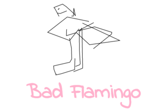

---

Pictionary, with an AI twist!

You, the **drawer**, create a drawing of a certain word or phrase. Your friend, the **guesser**, tries to guess what that word is, by looking at your image. However, a Convolutional Neural Network trained on hundreds of thousands of images is also in the running - and if the AI can guess the image, you both lose!


Bad Flamingo isn't just a game. The robustness and security of machine learning algorithms are becoming increasingly critical as AI systems make important decisions in work, life, and play. Crucial to understanding ML security are **adversarial training examples**, which are training examples that humans easily identify but puzzle machines.

Most adversarial training examples are generated by adding imperceptible noise to the training examples. In Bad Flamingo, however, users must draw fundamentally alternative images to fool the ML classifier. These proposed *semantic* adversarial examples test relations between captions and images that humans can understand, but ML models cannot. Playing Bad Flamingo will thus generate more difficult datasets for modern ML models and encourage further research in robust, human-like computer vision.

## Instructions

To start the server, run

```bash
npm install
npm run dev
```

Currently matchmaking infrastructure hasn't been set up yet. Simply navigate to
the following addresses on any browser:

- `{IP_ADDRESS}:8000/#/{GAME_CODE}/0` to play as the drawer
- `{IP_ADDRESS}:8000/#/{GAME_CODE}/1` to play as the *traitor* (see below)
- `{IP_ADDRESS}:8000/#/{GAME_CODE}/2` to play as the guesser

where `GAME_CODE` is any alphanumeric game code, and `IP_ADDRESS` is the
address of the machine hosting the server.

### The Traitor

We noticed that simple ways of fooling the AI include drawing squiggles over an
image, or surrounding an image with a border or a box, and others.

One option of fixing this (and making the game slightly more interesting) is to
include a third player, the *traitor*, who is on the side of the AI. The
traitor is not given the original label of the image, but is allowed to erase
lines in the image to attempt to make it more interpretable for the AI. The
guesser sees the original image as usual.

If you don't want to play with the traitor, then (for now) simply click submit
on his player - options for enabling/disabling this player are forthcoming.
